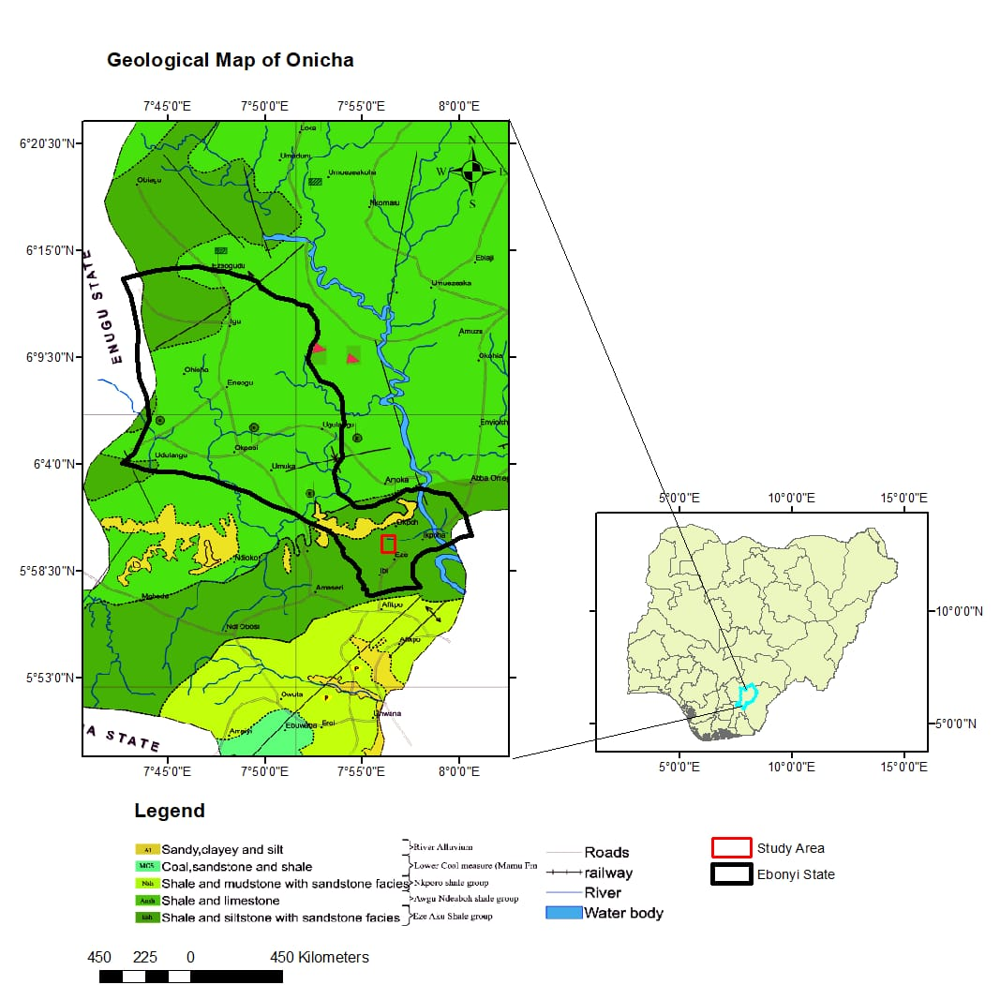

## Geological Mapping of Onicha Area (ArcGIS Pro)

### Overview
This project involved the creation of a geological map showing lithological units, boundaries, and spatial relationships within the study area.

---

### Methods
- Digitized geological boundaries and features  
- Integrated spatial data including roads, rivers, and study area  
- Designed map layout with legend and inset map  

---

### Results

#### Geological Map
The geological map displays different rock units and their distribution across the study area. It includes spatial features such as boundaries, roads, and water bodies, along with an inset map for geographic context.

---

### Tools Used
- ArcGIS Pro  
- Map layout design  
- Spatial data integration  
